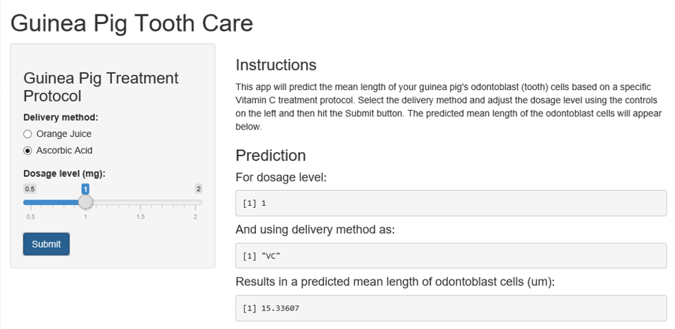

## Introduction

A Shiny application has been created to predict the effect of different Vitamin C delivery methods
and dosage levels on guinea pig tooth growth.  A simple linear model was built based on the ToothGrowth
dataset available in R. The user can choose the delivery method and adjust the dosage level within the application.  Upon hitting the submit button, a prediction of the mean odontoblast cell length (um) for the guinea pig is provided.

--- .class #id 

## Data Definitions
<style>
strong {
  font-weight: bold;
}
</style>

**Vitamin C:** Ascorbic acid  
**Odontoblasts:** Tooth cells  
**Delivery Method:** Vitamin C is delivered by orange juice or a dilution in water  
**Dosage Level:** Amount of Vitamin C in milligrams  
**Prediction Result:** Mean length of the odontoblast (tooth) cells in micrometers

---

## Predictive Model

A linear model (lm) for odontoblast cell length was built using the lm function.
```{r}
data(ToothGrowth)
lm(len ~ supp + dose, data=ToothGrowth)
```

---

## Shiny App

The Shiny app available at: https://datadavidz.shinyapps.io/project  




